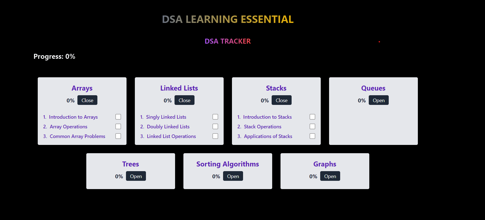

# TakeUForwardDsa 

## Overview (DSA Learning Essential)

TakeUForwardDsa is an interactive web application designed to help beginners learn and track their progress in Data Structures and Algorithms (DSA). This project provides a structured learning path, interactive problem sets, and progress tracking for various DSA topics.

## Features

- Interactive progress tracking for different DSA topics
- Problem sets for each subtopic with difficulty levels
- Resource links for additional learning
- User-friendly interface with expandable sections
- Local storage to save progress

## Getting Started

### Prerequisites

- Node.js (v14 or later)
- npm (v6 or later)

### Installation

1. Clone the repository:
   ```
   git clone https://github.com/aviacharya1/dsa-learning-essential.git
   ```

2. Navigate to the project directory:
   ```
   cd dsa-learning-essential
   ```

3. Install dependencies:
   ```
   npm install
   ```

4. Start the development server:
   ```
   npm start
   ```

5. Open your browser and visit `http://localhost:5713`

## Usage

1. Browse through different DSA topics on the main page.
2. Click on a topic to expand and view subtopics.
3. Mark subtopics as completed using the checkboxes.

## Project is live at:

- https://vercel.com/aviacharya1s-projects/take-u-forward-dsa


## Screenshots

 <br>

## Contributing

We welcome contributions to DSA Learning Essential! Here's how you can contribute:

1. Fork the repository.
2. Create a new branch: `git checkout -b feature-branch-name`
3. Make your changes and commit them: `git commit -m 'Add some feature'`
4. Push to the branch: `git push origin feature-branch-name`
5. Submit a pull request.

Please ensure your code adheres to the project's coding standards and include relevant tests if applicable.

## Project Structure

```
dsa-learning-essential/
├── src/
│   ├── components/
│   │   ├── DSAList.jsx
│   │   ├── Section.jsx
│   │   └── SubSection.jsx
│   ├── utils/
│   │   ├── calculateProgress.js
│   │   └── dsaTrackerList.js
│   ├── App.jsx
│   └── main.jsx
├── public/
│   └── tracker.svg
├── package.json
└── README.md
```

## Deployment

This project is configured for deployment on Vercel. Follow these steps to deploy:

1. Ensure your project is pushed to a Git repository.
2. Sign up for a Vercel account if you haven't already.
3. Connect your Git repository to Vercel.
4. Follow the Vercel deployment process, which will automatically detect your React app settings.

## License

This project is licensed under the MIT License - see the [LICENSE.md](LICENSE.md) file for details.

## Acknowledgments

- Thanks to all contributors who have helped shape DSA Learning Essential.
- Special thanks to the open-source community for providing invaluable resources and tools.

## Contact

For any queries or suggestions, please open an issue in the GitHub repository.

## Happy Coding....!


